<p align="center">
  <a href="https://amfora.solutionmax.net"></a>
</p>

<p align="center">
  <a href="https://github.com/Solutionmax/amfora/actions/workflows/ci.yml"></a>
  <a href="LICENSE"></a>
  
  
  
  
  <a href="https://buymeacoffee.com/solutionmax"></a>
</p>

<p align="center">
  <a href="https://amfora.solutionmax.net">Website</a> ·
  <a href="https://amfora.solutionmax.net/docs/">Documentation</a> ·
  <a href="https://amfora.solutionmax.net/#install">Install</a> ·
  <a href="#what-is-in-the-box">Features</a> ·
  <a href="LICENSE">Licence</a> ·
  <a href="https://amfora.solutionmax.net/legal.html">Legal &amp; privacy</a>
</p>

# Amfora

**Self hosted file sharing. Send, receive and keep control.**

Amfora is a self hosted workspace for sending and receiving files. Upload files
to storage you control, turn them into a guarded share, or give someone a
browser link where they can send files back without creating an account.

<p align="center">
  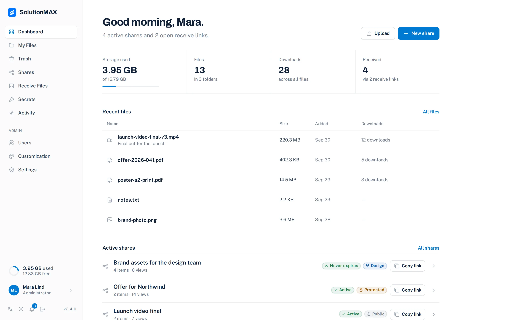
</p>

## The workflow

### 1. Keep files in one workspace

Open **My Files** to upload files, create folders, and see what is stored. The
workspace tracks uploads and makes the same files available when you create a
share. Deleting a file or folder moves it to the **Trash**, where it stays for
30 days (an administrator can change that) and can be restored. Only deleting
it there, or emptying the trash, removes it from storage.

### 2. Send a controlled link

Select files and choose **Create share**. Give the share a name, then choose
the restrictions that fit the handoff:

- password protection;
- expiration date;
- maximum views;
- recipient email notifications; and
- a group, so that only its members can open the link.

Amfora creates an `/s/<alias>` link. Recipients open it in a browser and do not
need an Amfora account, unless the share is limited to a group: then they sign
in first. Members see such shares under **Shared with me**. The owner can later
edit the share, its files, and its restrictions. An administrator can set a
default and a maximum lifetime for links, and can have ended links removed
automatically.

### 3. Receive files from outside

Open **Receive files**, set optional file count, size, type, password, and
expiration limits, then copy the `/r/<alias>` link. A sender uploads through
the public page and can be asked for a name or email address. The owner reviews
those uploads in **Reverse shares**, downloads them, or copies them into the
workspace.

### 4. Share a secret

Open **Secrets** to send a password or a key. The text is encrypted in your
browser; the key is part of the `/x/<id>#<key>` link and never reaches the
server. You choose how long the link lives and how often it may be opened.
After the last opening the text is destroyed.

### 5. See what happened

**Activity** lists what happened to your links: opened, downloaded, a wrong
password, files received, a secret opened, and where the visitor was. You can
ask for an email when a share is downloaded or a reminder before a link ends.
The bell in the menu shows what is new for you: a download, files received, a
secret opened, a link that ends soon, storage almost full, or a file found
infected by the virus scan. Administrators can clear the log.

## Product tour

The screenshots show the English interface with demonstration data.

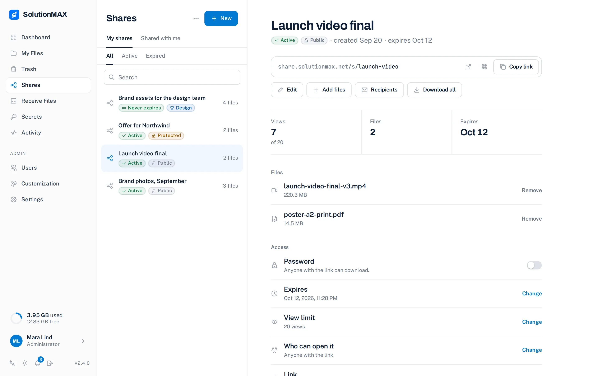

Shares are a list on the left and the one you picked on the right: its link,
its files, and the password, end date and view limit you can change at any time.

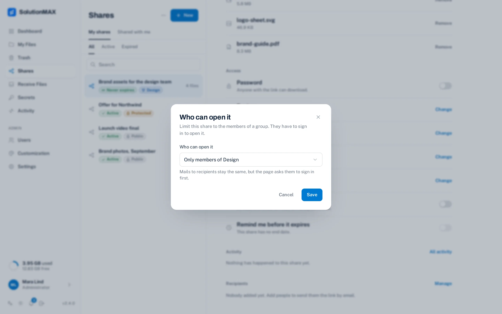

Under "Who can open it" a share can be limited to a group. Only its members,
once signed in, can open it.

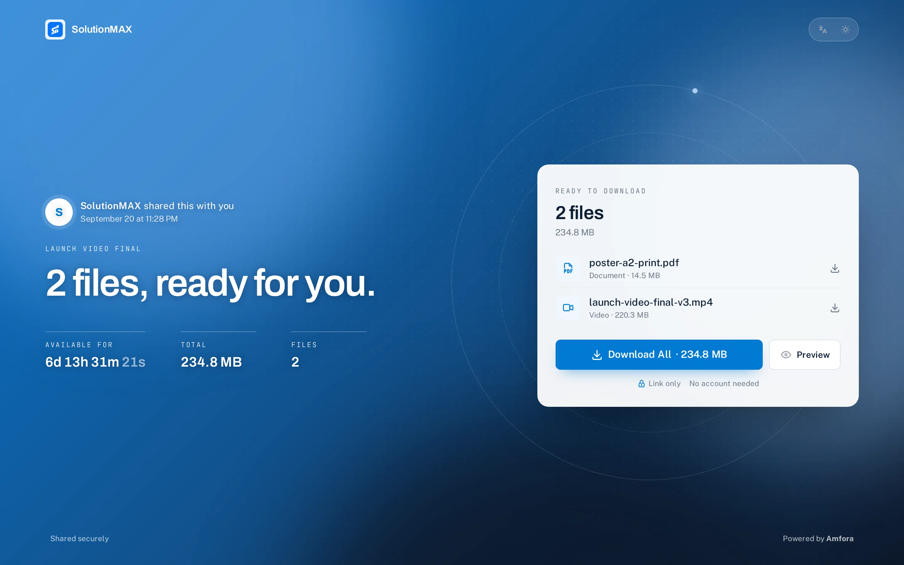

A download page says who shared it and what is in it, with one button to
download it all. This is the Stage theme; Workbench and Seal are the other two.

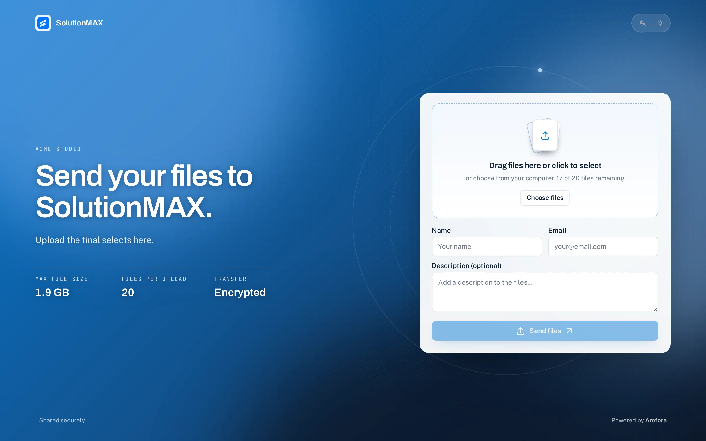

A receive link gives outside collaborators a simple upload form with the limits
set by its owner.

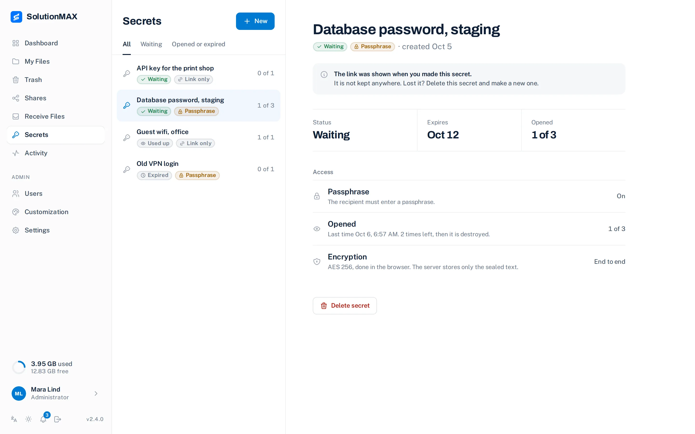

Secrets keep a record of every link you made: waiting, used up or expired, and
how often it was opened. The text itself is never in the list.

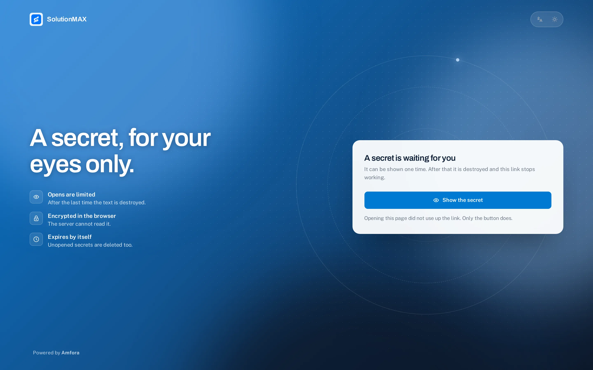

The reader presses one button to see the secret. Loading the page costs
nothing, so a chat app that fetches the link for a preview cannot use it up.

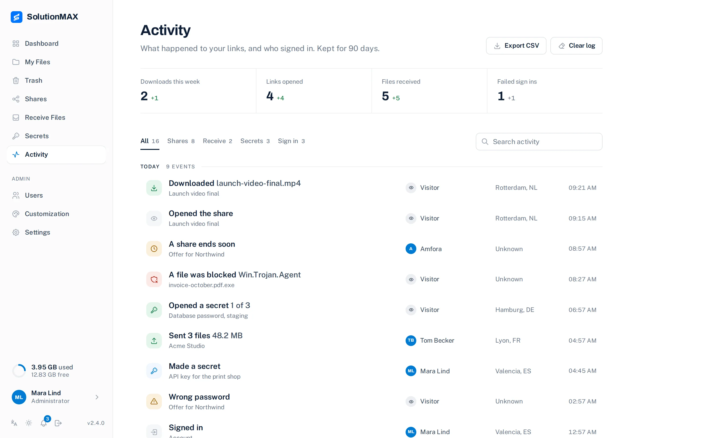

Activity groups what happened per day. A user sees their own links, an
administrator sees everyone. The address of a visitor is never stored, only the
place it points to.

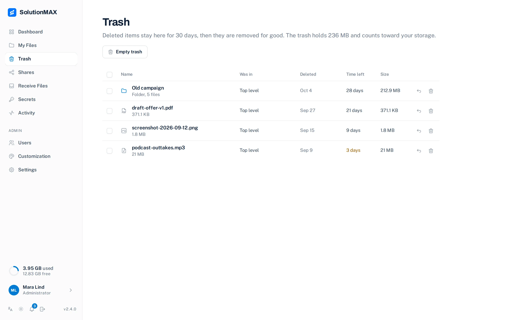

Deleted files and folders wait in the Trash with the days they have left. Restore
them, or delete them for good.

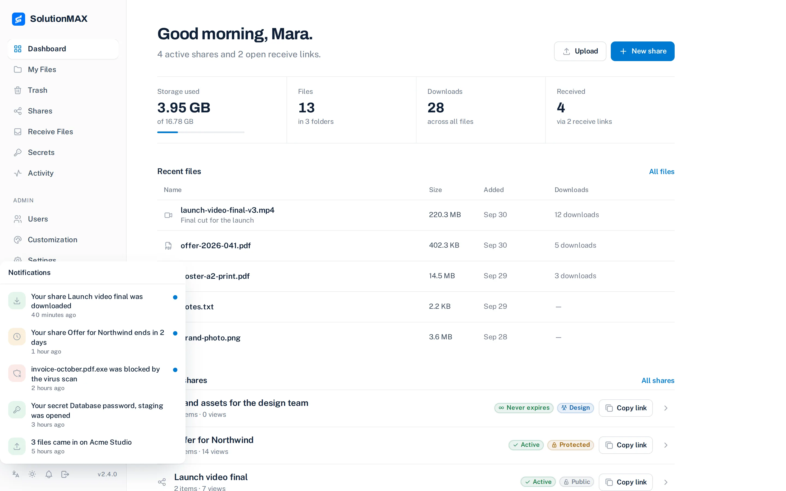

The bell in the menu lists what is new for you, such as a download or a link
that ends soon.

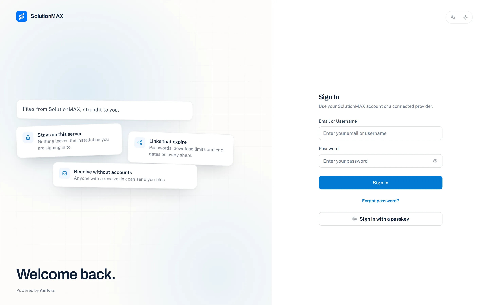

The sign in screen supports password authentication, password recovery, and
two factor authentication when it is enabled for the account. Users can also
sign in with a passkey.

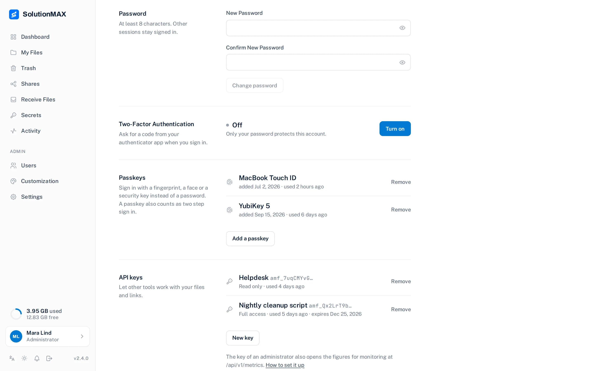

Passkeys and two step sign in are set up on the profile page. An administrator
can ask for them from everyone.

## What is in the box

| | |
|---|---|
| **Workspace** | Files, folders, downloads and shares, with a dashboard for recent activity and storage usage. |
| **Trash** | Deleted files and folders wait in a trash for 30 days by default, then go for good. Restore puts them back where they were. |
| **Send files** | Download links with optional passwords, expiry dates, view limits, recipient email notifications and QR codes. |
| **Collect files** | Upload requests with optional password, expiry, file count, size and type limits. Senders do not need an account. |
| **Limits and lifetime** | A storage limit for the installation and one per user. A default and a maximum lifetime for links. Ended links can be removed by themselves after a number of days. |
| **Groups** | Administrators make groups of users. A share can be limited to one group, and members find such shares under "Shared with me". |
| **Secrets** | Passwords and keys behind a link that destroys itself. Encrypted in the browser, opened a set number of times, optional passphrase. Optionally open to visitors without an account. See [docs/SECRETS.md](docs/SECRETS.md). |
| **Activity** | A log per user of what happened to links and accounts, with the place of a visitor, a CSV export, emails to the maker and signed webhooks. Administrators can clear it. See [docs/ACTIVITY.md](docs/ACTIVITY.md). |
| **Notifications** | A bell in the app shows downloads, received files, opened secrets, links that end soon, storage almost full and infected files. It reads from the activity log. |
| **Virus scan** | Optional. Every uploaded file is checked with ClamAV, and a file that is infected or still being checked cannot be downloaded. Off unless you set `CLAMAV_HOST`. See [docs/VIRUS-SCAN.md](docs/VIRUS-SCAN.md). |
| **API** | API keys with read or full access for other tools. See [docs/API.md](docs/API.md). |
| **Monitoring** | Figures in the Prometheus format for Prometheus and Zabbix, readable with the API key of an administrator. See [docs/MONITORING.md](docs/MONITORING.md). |
| **Storage** | Bundled MinIO or an external S3 compatible provider, on infrastructure you control. |
| **Branding** | Application name, description, logo, accent colour, font, corner radius and default language, all stored on the server. The preview shows the real download, sign in and receive pages, and emails carry your logo. A [brandpack](https://amfora.solutionmax.net/brandpack/) removes the "Powered by Amfora" credit and unlocks a background image and custom CSS. |
| **Access** | User invitations, roles, deactivation, trusted devices and TOTP two factor authentication with backup codes. Optional OAuth2/OIDC sign in. |
| **Sign in security** | Passkeys, an optional requirement that administrators or everyone set up two step sign in or a passkey, and a reset of the two step sign in of another user. |
| **Languages** | English, Dutch, German, French, Spanish, Italian, Portuguese of Brazil and Polish. Italian, Portuguese and Polish were translated without review by a native speaker. |

## Make it yours

Everything a visitor sees reads the installation's name, logo and accent colour
from the server, so every recipient sees the same brand on every device. The
free version shows "Powered by Amfora" on the public pages. A
[brandpack](https://amfora.solutionmax.net/brandpack/) is a signed key that
removes that credit and unlocks a background image for the public pages and
custom CSS. It is issued to one organisation, works on every installation that
organisation runs, never expires, and is verified locally with an Ed25519
signature: nothing phones home. Paste it under **Customization → Brandpack**.
Details for operators are in [docs/BRANDPACK.md](docs/BRANDPACK.md).

## Install Amfora

You need Docker with Compose v2. The installer creates an `amfora` directory,
writes a compose file pinned to the current release, pulls
`ghcr.io/solutionmax/amfora` (amd64 and arm64) and starts it. It refuses
existing installations and does not install Docker.

```bash
curl -fsSL https://amfora.solutionmax.net/get | sh
```

Open <http://localhost:5487>. On a new database, the first account created
through the first run screen becomes the administrator. Later accounts are
ordinary users unless an administrator invites or promotes them.

The compose file publishes the web interface on `5487` and bundled storage on
`9379`. The browser must be able to reach `STORAGE_URL`; the local example uses
`http://127.0.0.1:9379`. The API listens on `3333` inside the container and is
not published.

Prefer plain compose? Use [docker-compose.yaml](docker-compose.yaml) from this
repository, which documents every option, and run `docker compose up -d`.

### Build from source

`curl -fsSL https://amfora.solutionmax.net/get | sh -s -- --source` clones the
release tag and builds it (Git, Bash and Buildx 0.30 or later). From a checkout:

```bash
make build TAG=local
AMFORA_IMAGE=amfora:local docker compose up -d
```

The dedicated builder reuses layers and bounds unused cache to a 4 GB target.
`make clean` reclaims only build cache, preserving images and application data.
See [build and cache management](docs/deployment/build-cache.md).

## Updating

Your files and settings live in the `amfora_data` volume; an update only
replaces the image.

```bash
cd amfora
# set the new version in docker-compose.yaml, for example ghcr.io/solutionmax/amfora:2.0.1
docker compose pull
docker compose up -d
```

The admin area shows when a newer release is out. To have the host install
signed releases for you, set up [over the air updates](docs/OTA.md) once. Every
release is listed on the [releases page](https://amfora.solutionmax.net/releases/).
Keep the previous image until the new one runs, so you can switch back.

## Storage and deployment

The image includes a private MinIO storage service. You can use an
external S3 compatible provider instead:

```yaml
environment:
  ENABLE_S3: "true"
  STORAGE_URL: "https://files.example.com"
  S3_ENDPOINT: "s3.example.com"
  S3_ACCESS_KEY: "your-access-key"
  S3_SECRET_KEY: "your-secret-key"
  S3_BUCKET_NAME: "amfora-files"
  S3_USE_SSL: "true"
```

`STORAGE_URL` is the browser facing URL used for generated upload and download
requests. Put both the app and that storage endpoint behind HTTPS, keep the API
on the private container network, and set `SECURE_SITE=true` for secure cookies.
Configure HSTS at the HTTPS reverse proxy.

The seeded workspace defaults to a 1 GiB maximum file size and 10 GiB maximum
storage per user; an administrator can change those limits in Settings, and set
a different limit for one user. The trash counts toward that limit. See
[`docker-compose.yaml`](docker-compose.yaml) and
[`apps/server/.env.example`](apps/server/.env.example) for the complete
configuration, including S3, proxy, CORS, and rate limit settings.

### Optional virus scan

Set `CLAMAV_HOST` to a [ClamAV](https://www.clamav.net/) scanner (clamd) and
Amfora checks every uploaded file, also the ones received on a receive link,
after the upload. A file that is being checked or is infected cannot be
downloaded, previewed or shared. `CLAMAV_PORT` (3310) and `CLAMAV_MAX_SIZE_MB`
(100) are optional. `docker-compose.yaml` has a commented `clamav` service; it
needs about 1.2 GB of memory. Without `CLAMAV_HOST` nothing changes. See
[docs/VIRUS-SCAN.md](docs/VIRUS-SCAN.md).

Amfora does not promise application level encryption at rest or end to end
encryption. Protect the host or S3 account with the controls appropriate to the
deployment. Passwords are stored as bcrypt hashes, and share passwords are sent
in a request header rather than in a URL.

## Administration

Administrators can invite and manage users, assign roles, configure storage and
limits, customize the application, configure email, and enable authentication
providers. A new installation offers Authentik, GitHub, and Google; any other
compatible OIDC or OAuth 2.0 provider can be added.

**Storage and links.** Under Settings, Storage, an administrator sets the
maximum file size, the default storage per user, the default and maximum
lifetime of links in days (0 means none), how long the trash keeps items
(`trashRetentionDays`, 30 by default) and after how many days an ended link is
removed (`expiredLinkRetentionDays`, 0 by default, which means never). Only the
link goes: the files it pointed to stay. A limit for one user is set in the
user form on the Users page; empty means the default.

**Users and groups.** The Users page has a Groups tab to make groups and add or
remove members. An administrator can also switch off the two step sign in of
another user there, for example after a lost phone. Passkeys stay.

**Two step sign in.** Each user can enable TOTP two factor authentication,
download backup codes, remove trusted devices and add passkeys on the profile
page. Under Settings, Security, an administrator can require two step sign in or
a passkey from administrators or from everyone (`twoFactorRequired`, off by
default). Turning it on signs nobody out. API keys and external providers are not
affected. If it locks you out, see [Locked out of two step sign in](#locked-out-of-two-step-sign-in).
Passkeys need an https address or `localhost`.

Password reset requires password authentication and a working SMTP
configuration. Invite links are one time registration links.

**Monitoring.** `GET /api/v1/metrics` gives figures in the Prometheus format,
readable with the API key of an administrator. See
[docs/MONITORING.md](docs/MONITORING.md).

**Release notes and updates.** Settings shows what the version you run brought,
in your language. Administrators also see a notice in the menu when an update
is available.

## Backups and upgrades

For bundled storage, back up the persistent `/app/server` directory, including
`prisma/amfora.db`, `minio-data`, and the generated storage credentials. For
external S3, back up the SQLite database and the S3 bucket according to the
provider’s procedure. Keep the persistent volume when replacing the image;
startup applies schema changes and seeds missing configuration/provider data.

Upgrading to 2.4.0 adds its tables and columns by itself at the first start:
the trash, scan status, passkeys, groups and the limit per user. Nothing is
asked and your data stays in place. A share stays open to anyone with the link
until somebody limits it to a group. Going back to an older version needs the
database backup from before the upgrade: take a copy of `prisma/amfora.db`
(with the rest of `/app/server` for bundled storage) first, and put it back
when you return to an older version. Whatever was done in 2.4.0 is lost with it. The full list is in the
[2.4.0 release notes](docs/RELEASE-2.4.0.md), which also name three security
repairs: install this release soon.

Installations created under Palmr are migrated from `prisma/palmr.db` to
`prisma/amfora.db`, while an existing internal bucket is preserved when no
explicit bucket override is supplied. Verify a test share and download after
an upgrade.

To recover a password from a trusted operator shell:

```bash
docker compose exec amfora sh -lc 'cd /app/amfora-app && ./reset-password.sh'
```

Use `--list` to list users. This tool bypasses normal account flows.

## Security

### Locked out of two step sign in

If the only administrator loses the authenticator while `twoFactorRequired` is on, start the
server with `TWO_FACTOR_REQUIRED=off` (the other values are `admins` and `all`). It wins over
the setting in the database, and Settings then shows the select as set by the server
configuration. Restart, sign in, repair the account (set up a new second step or reset it from the
Users page), remove the variable and restart again. Capitals, spaces and quotes around the value
do not matter; any other value is ignored, and the server log says so at start.

With Docker Compose, `docker compose restart` does not read the environment again: after you change
`docker-compose.yaml` run `docker compose up -d`, which recreates the container.

### Security configuration

Set `APP_URL` to the canonical browser origin (for example `https://files.example.com`)
before enabling password reset email. Public deployments must use HTTPS for both app
and storage and `SECURE_SITE=true`. The API binds to loopback inside the container by
default; publish only the web and storage services through your TLS ingress.

Client supplied IP headers are ignored by default. Only behind an ingress that replaces
incoming forwarding headers and blocks direct web access, set
`TRUST_CLIENT_IP_HEADERS=true` for the web process and `TRUST_PROXY=127.0.0.1,::1`
for the API's known proxy hops. Never configure blanket trust of arbitrary proxies.
Behind Cloudflare the visitor named in `CF-Connecting-IP` is then used for rate limits
and for the place shown in Activity.
Without this opt in, request rate limits conservatively share the proxy address;
password failures are additionally limited per account.

Public upload clients must request a server generated temporary key with filename,
extension and byte size, then register that same authorized upload. Registration
needs an object name that starts with your own user id and is not in use, and the
object must already be in storage: its size is measured there, not taken from the
client. Old clients that choose arbitrary object keys must be updated. Two factor login now requires the `challengeId` returned by the
password step; it expires after five minutes and is single use. Existing remembered
devices must complete 2FA again to receive a secure random device cookie.

## Development

```bash
cd apps/web && pnpm install && pnpm dev       # http://localhost:3000
cd apps/server && pnpm install && pnpm dev   # http://localhost:3333
```

Run server tests with `cd apps/server && pnpm test`. Before opening a change,
the web checks `pnpm format:check` and `pnpm type-check` are useful alongside
the repository’s normal build and lint commands.

## Origins

Amfora began as a fork of [Palmr](https://github.com/kyantech/Palmr), archived in
February 2026, and has been developed independently since. Attribution and
modification notices are in [NOTICE](NOTICE).

## Licence and attribution

Amfora is licensed under the Apache License 2.0; see [LICENSE](LICENSE). The
bundled `minio` and `mc` programs are separate, unmodified AGPL-3.0 programs
redistributed with the image. See [NOTICE](NOTICE) and
[`LICENSES/AGPL-3.0.txt`](LICENSES/AGPL-3.0.txt) for attribution and source
information.

---

<sub>Amfora, a <a href="https://solutionmax.net/">SolutionMAX</a> product ·
<a href="https://amfora.solutionmax.net/">Website</a> ·
<a href="https://amfora.solutionmax.net/docs/">Documentation</a> ·
<a href="https://amfora.solutionmax.net/legal.html">Legal &amp; privacy</a></sub>

## Support the work

Built and maintained by [SolutionMAX](https://solutionmax.net/).
If Amfora helps your team, you can [support the work](https://buymeacoffee.com/solutionmax).
